# Week 0 — Billing and Architecture
## Highlights
* Got to know about the what, how, why, when and where about the free aws cloud project bootcamp wherein we will be developing and deploying a microblogging platform by name cruddur on aws cloud.
* Understood the architectural diagram of the cruddur platform (i.e. conceptual and logical diagram). 
* AWS CLI & Spend Considerations
* Breif overview of AWS Well Architected Framework
* Got to know AWS Cloud Security best practices. 
* Tools to use to scrub sensitive data part of Github repository and its commit history.

## Homework - To Do Checklist
1. Watched Week 0 live streamed videos

2. Watched Chirag's Week 0 - Spend Considerations. Brief notes given below

3. Watched Ashish's Week 0 - Security Considerations. Brief notes given below
    * **What** : Identify and inform the business of any technical risk that the business may be exposed to 
    * **Why care about cloud security ?**
      * reduce the impact of breach
      * protecting networks applications, services in cloud environments against malicious attack and data theft
      * reducing the human error responsible for data leaks. making sure right people has access to the info.
    * **Must know AWS Cloud security best practices**
      * Add MFA to root user.
      * Create an organizational unit.
      * Enabling AWS Cloud Trial.
      * Create IAM users.
      * Root user credential should not be used on a day to day basis.
      * For any AWS service, create and add a tag, helps in managing cost and security policies.
      * Create AWS IAM roles & policies.
        * <u>What is a Role</u>: identity you can create that has specific permissions w. credentials that valid for short duration. Roles can be assumed by identities that you trust. E.g. IAM Users, AWS EC2 instancese etc.
        * <u>What is a Policy</u>: object in AWS that defines permissions. E.g. Real-Only Policy, Security Audity Policy
      * Enable AWS Organization SCP(Service Control Policies).
      * Enable AWS Guard Duty (Threat Detection Software).

4. Recreate Conceptual Diagram in Lucid Charts and on a Napkin. 
   *  Conceptual Design using Napkin
      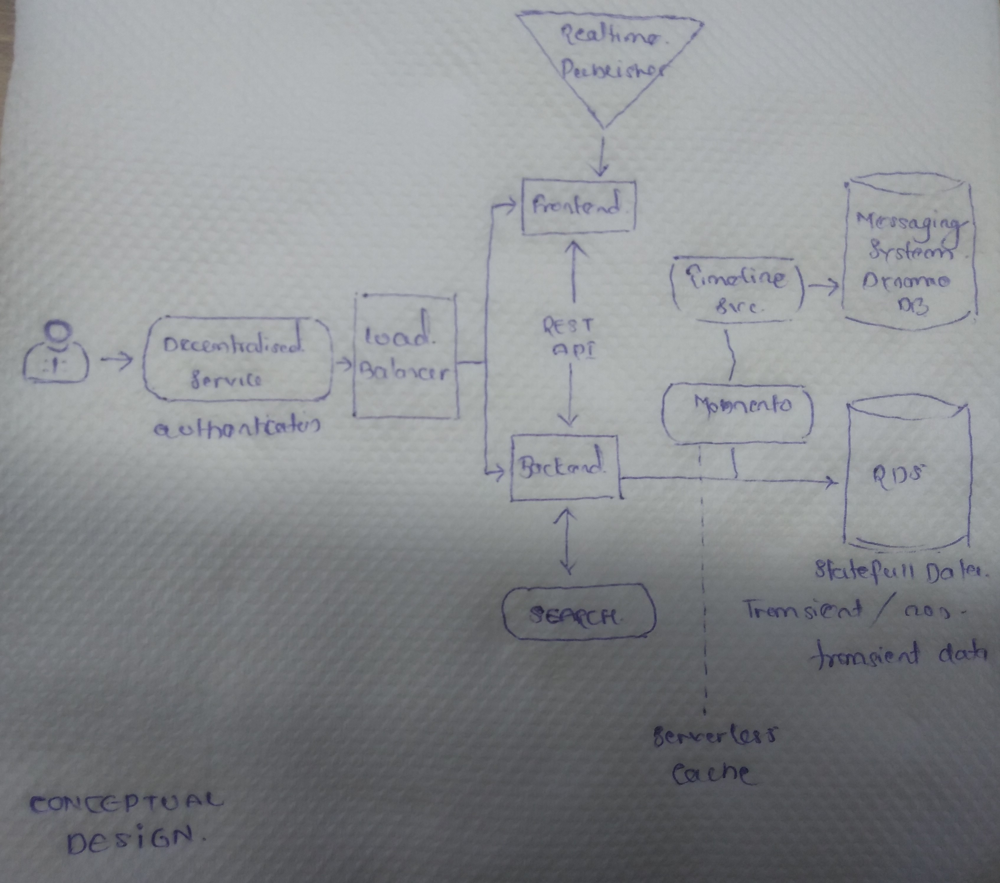
   *  Conceptual Design using Lucid Chart
      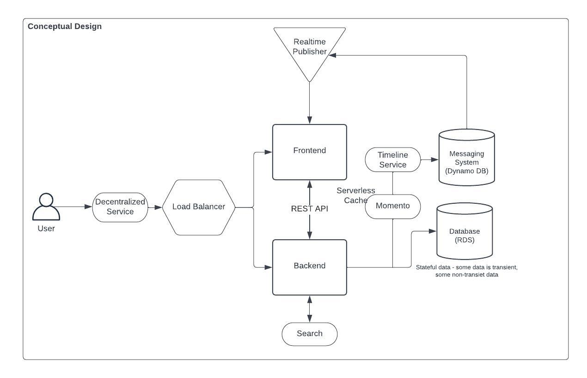
	
5. Recreate Logical Architectual Diagram in Lucid Charts. Please find attached it below
   * Logical Design using Lucid Chart
     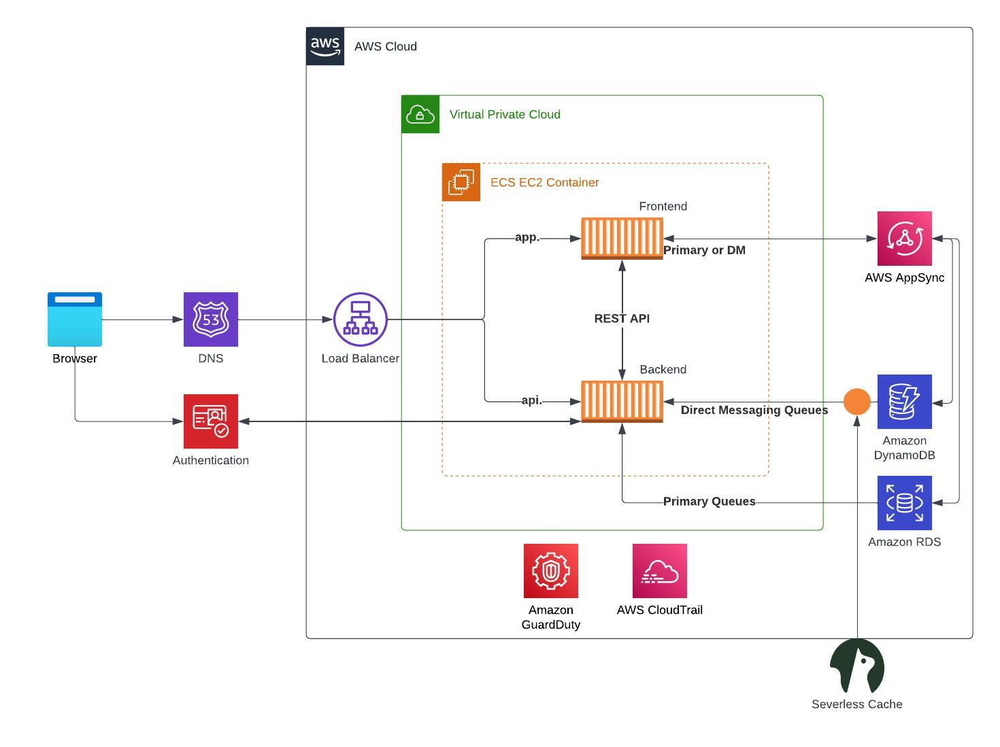

6. Create an Admin User. 
   * Created IAM User .<br/>
       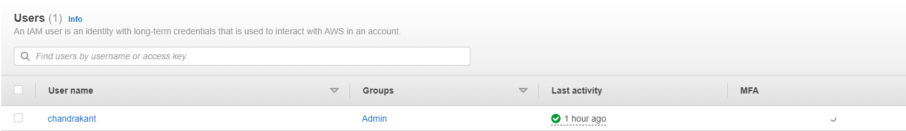

7. Use CloudShell. 
   * AWS CloudShell is a browser-based shell that provides command line access to AWS resources and tools directly from a browser.
   * Usecases include :
     * optimize your daily tasks
     * simplify your workflow
     * simplify infrastructure management
   * AWS CloudShel when launched gives us default linux terminal env. 
     * To check the list of installed tools in AWS CLI w.r.t your region, run the below command
         ```
         ll /usr/local/bin 
         ```
     * Shell env. is preconfigured with our AWS Credentials. To fetch the AWS credentials, run the below command.
         ```
         aws sts get-caller-identify
         ```
     * We can also run, install etc. programming language runtimes like python & nodejs built in using the sudo command as well ability to install additional softwares needed.  To install and initialize the aws cloud development kit (kit) run the below command
         ```
         sudo npm install -g aws-cdk
         cdk init app --language typescript
         ```
     * Any global changes we make to our operating system will last until our cloud shell session expires, even if we exit and return to our cloud shell before it times out, our installed programs will exist.
     * Data stored in the persistent storage of 1 GB available to us with the AWS Shell will exist even if the session expries and we re-launch it.
  
8. Generate AWS Credentials. 
   * Goto Identity and Access Management (IAM) service
   * Under **Access Management**, goto **Users**. This wll open the Users Dashboard
   * Under **User**, click on the admin user, it will take you to the user dashboard
   * On the User Dashboard, click on the **Security Credentials** 
   * Under Security Credentials, goto the **Access Keys section**, to the right you will have **Create Access Key** button.
   * Snapshot of Access Key created below for reference
      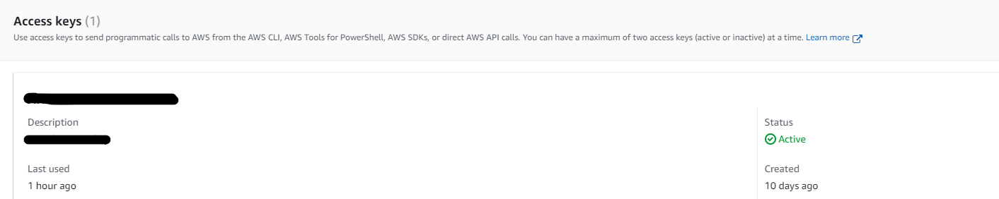
9.  Installed AWS CLI
    * We are going to install the AWS CLI when our Gitpod enviroment lanuches
    * The bash commands we are using are the same as the [AWS CLI Install Instructions]https://docs.aws.amazon.com/cli/latest/userguide/getting-started-install.html
    * Update our ```.gitpod.yml``` to include the following task.
      ```
      tasks:
         - name: aws-cli
         env:
         AWS_CLI_AUTO_PROMPT: on-partial
         init: |
            cd /workspace
            curl "https://awscli.amazonaws.com/awscli-exe-linux-x86_64.zip" -o "awscliv2.zip"
            unzip awscliv2.zip
            sudo ./aws/install
            cd $THEIA_WORKSPACE_ROOT
      ```
10. Create a Billing Alarm
    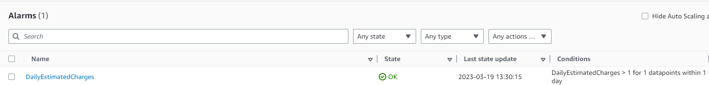

11. Create a Budget
    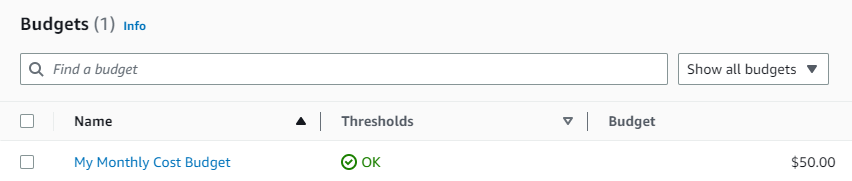

## Homework - Stretch Assignments
1. Destroy your root account credentials, Set MFA, IAM role
   * For increased security, its recommended to configure multi-factor authentication (MFA) to help protect AWS resources. 
   * You can enable MFA for the AWS account root user and IAM users. W
   * hen you enable MFA for the root user, it affects only the root user credentials. 
   * IAM users in the account are distinct identities with their own credentials, and each identity has its own MFA configuration. 
   * You can register up to eight MFA devices
   * To setup MFA access the link [Instruction to set up MFA](https://docs.aws.amazon.com/IAM/latest/UserGuide/id_credentials_mfa_enable_virtual.html)
   * Snapshot for reference that MFA is set or Root account and IAM user account
   * 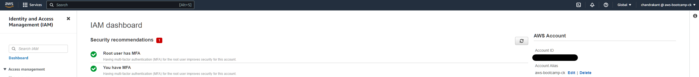
2. Use EventBridge to hookup Health Dashboard to SNS and send notification when there is a service health issue.
   * AWS Eventbridge is a serverless event bus that makes it easier to build event-driven applications as scale using events generated from your applications, integrated Software-as-a-Service (SaaS) applications and AWS Services.
   * Amazon EventBridge is a service that provides real-time access to changes in data in AWS services, your own applications, and software as a service (SaaS) applications without writing code. To get started, you can choose an event source on the EventBridge console.
   * An event is a record of action that has happened in the past. It is represented as a JSON Object that contains data from the event and data of the event i.e. Metadata
   * For e.g., if someone saves a file to S3 bucket, an event is created containing the bucket the file was saved to and the key or name of the file. It will also contain data about when it was saved, size of the file and other metadata that helps developers understand the event 
   * Detailed Steps below to create a rule using AWS Event Bridge.
      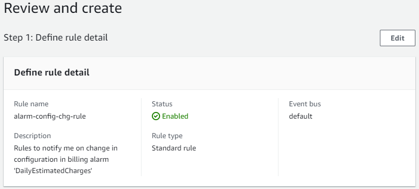
      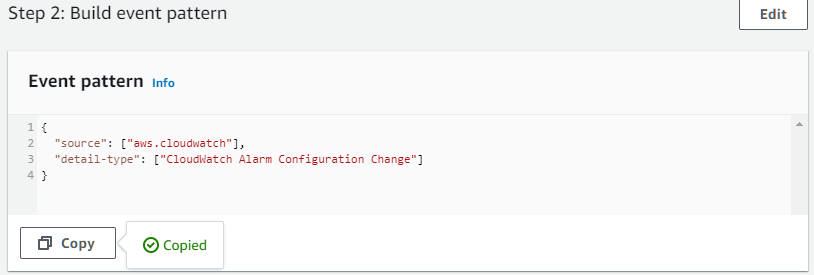
      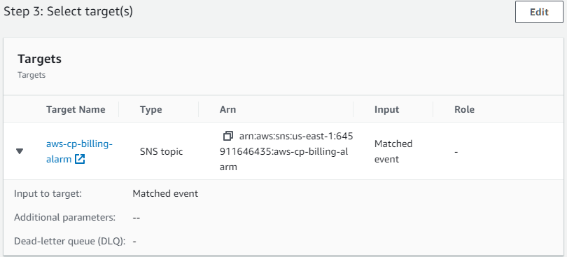
   * In the below example, have created an event when there is a change in alarm configuration being set up. 
     * In this case previously when I created billing alarm named 'DailyEstimatedCharges' wehrein this alarm would be triggered if the daily estimated charges exceeds (i.e. >=) 1$. I have changed the conditions to greater than (>) instead of greater than or equal to (>=). Snapshot for Reference
         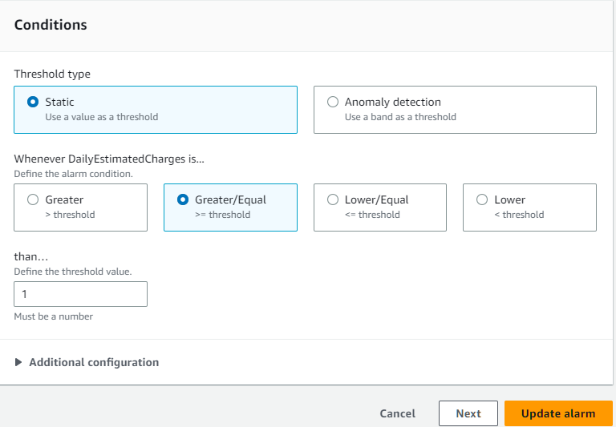
         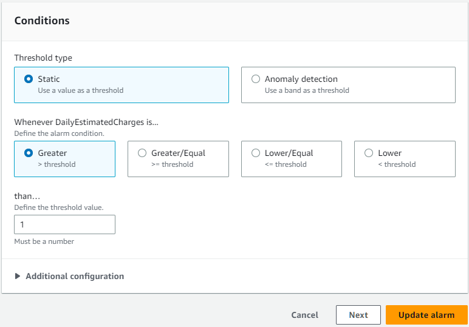
   * The above change triggers a event an indicator of a change in environment, and applies a rule to route the event to a target (SNS Topic).
3. Review all the questions of each pillars in the Well Architected Tool (No specialized lens)
      * What is it ? Use the AWS Well Architected Framework to review your workloads against current AWS best practices.
      * Workload is a collection of resouurces and code that make up a cloud application.
      * 6 pillars of AWS Well Architected Framework are as follows:
        * Operational Excellence - How do you mitigate deployment risks
        * Security - How do you manage identities for people
        * Reliability - How do you monitor workload resources
        * Performance - How do you select the best performing architecture
        * Cost Optimization - How do you implement cloud financial management
        * Sustainibility Pillar - How do your development and deployment process support your sustainability goags. 
4. Create an architectural diagram (to the best of your ability) the CI/CD logical pipeline in Lucid Charts
      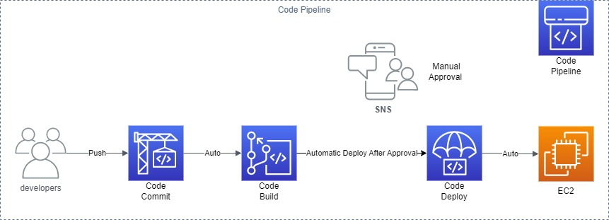 
5. Open a support ticket and request a service limit
   * Search and Access AWS Support service
   * Create a Case (For free tier account, technical support is not available only account and billing support is available)
   * Select Service, Category & Severity
   * Add Additional Info. like - Describe  your question or issue
   * Review and select Contact Us via Web
   * Click on submit
   * Snapshot of a support ticket submitted below:
      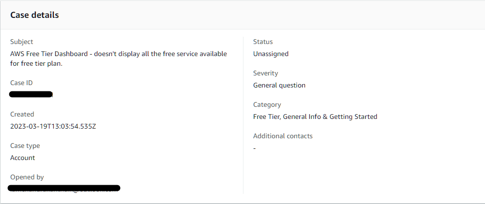


## Further Resources & References
* [AWS CLoud Shell]https://aws.amazon.com/cloudshell/
