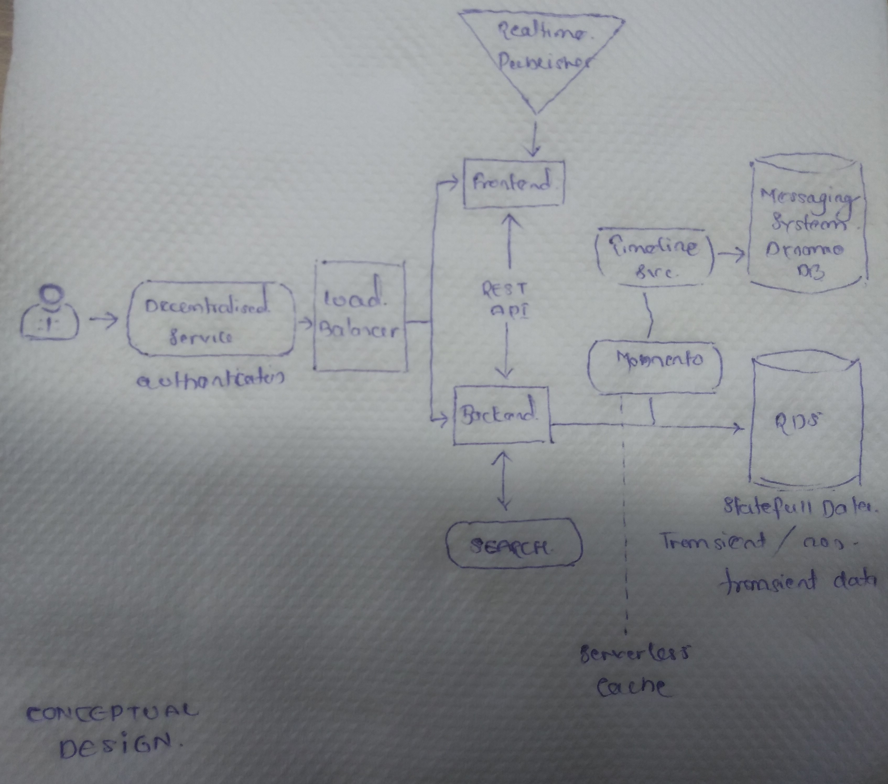
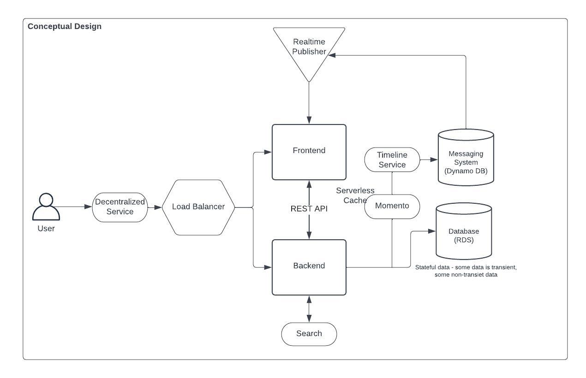
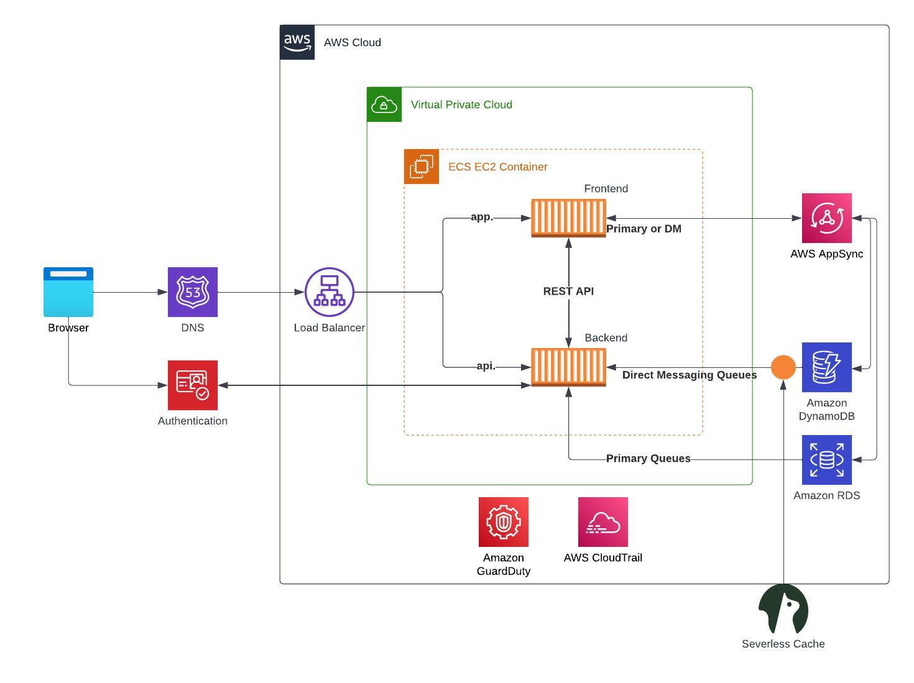

# Week 0 — Billing and Architecture
## Highlights
* Got to know about the what, how, why, when and where about the free aws cloud project bootcamp wherein we will be developing and deploying a microblogging platform by name cruddur on aws cloud.
* Understood the architectural diagram of the cruddur platform (i.e. conceptual and logical diagram). 
* ? AWS CLI & Spend Considerations
* Breif overview of AWS Well Architected Framework
* Got to know AWS Cloud Security best practices. 
* Tools to use to scrub sensitive data part of Github repository and its commit history.

## Homework - To Do Checklist
1. Watched Week 0 live streamed videos

2. Watched Chirag's Week 0 - Spend Considerations. Brief notes given below
   * ? Importance

3. Watched Ashish's Week 0 - Security Considerations. Brief notes given below
    * **What** : Identify and inform the business of any technical risk that the business may be exposed to 
    * **Why care about cloud security ?**
      * reduce the impact of breach
      * protecting networks applications, services in cloud environments against malicious attack and data theft
      * reducing the human error responsible for data leaks. making sure right people has access to the info.
    * **Must know AWS Cloud security best practices**
      * Add MFA to root user.
      * Create an organizational unit.
      * Enabling AWS Cloud Trial.
      * Create IAM users.
      * Root user credential should not be used on a day to day basis.
      * For any AWS service, create and add a tag, helps in managing cost and security policies.
      * Create AWS IAM roles & policies.
        * <u>What is a Role</u>: identity you can create that has specific permissions w. credentials that valid for short duration. Roles can be assumed by identities that you trust. E.g. IAM Users, AWS EC2 instancese etc.
        * <u>What is a Policy</u>: object in AWS that defines permissions. E.g. Real-Only Policy, Security Audity Policy
      * Enable AWS Organization SCP(Service Control Policies).
      * Enable AWS Guard Duty (Threat Detection Software).

4. Recreate Conceptual Diagram in Lucid Charts and on a Napkin. 
   *  Conceptual Design using Napkin
      
   *  Conceptual Design using Lucid Chart
      
	
5. Recreate Logical Architectual Diagram in Lucid Charts. Please find attached it below
   * Logical Design using Lucid Chart
     

6. Create an Admin User. 
   * Created AWS Root account. 
       

7. Use CloudShell. 
8. Generate AWS Credentials. 
9.  Installed AWS CLI
10. Create a Billing Alarm
11. Create a Budget

## Homework - Stretch Assignments

## Further Resources & References
